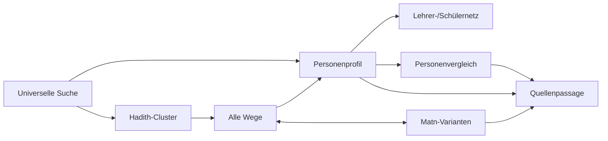

# Informationsarchitektur

```text
Sanad Atlas
├── Universelle Suche
│   ├── Überlieferer
│   ├── Hadithe / Textfragmente
│   ├── Bücher / Kapitel / Nummern
│   ├── Orte / Ṭabaqāt
│   └── Quellenpassagen
├── Hadith-Wege
│   ├── Clusterübersicht
│   ├── Alle Wege
│   ├── Sammlungsfilter
│   ├── Ketten-/Kantenbeleg
│   └── verknüpfte Matn-Varianten
├── Überlieferer
│   ├── Identität und Namensvarianten
│   ├── Biografie
│   ├── Lehrer / Schüler
│   ├── Hadith-Vorkommen
│   ├── Jarḥ wa-Taʿdīl
│   ├── Quellen
│   └── Identitätskonflikte
├── Lehrer & Schüler
│   ├── Ego-Graph
│   ├── Evidenzfilter
│   └── große Gruppen als Liste
├── Vergleich
│   ├── Netzwerk
│   ├── Biografie
│   ├── Hadith-Überlieferung
│   └── Aussagenmatrix
├── Matn-Varianten
│   ├── Parallelansicht
│   ├── Differenzansicht
│   └── gekoppelte Wege
└── Quellen
    ├── Quellenpassagen
    ├── Editionen
    ├── Data Rights
    └── Datenversionen
```

## Navigationsregeln

- Ein Klick auf eine Person setzt sie fachlich in den Fokus; im Hadith-Modus bleibt der Clusterkontext erhalten.
- Das Informationspanel ist eine Detailvorschau. Vollseiten werden nur für komplexe Arbeitsabläufe geöffnet.
- Zurück stellt die vorherige Auswahl und nicht lediglich die vorherige URL wieder her.
- Große Beziehungsgruppen öffnen eine durchsuchbare Liste, bevor weitere Knoten geladen werden.
- Filter werden als URL-Parameter in der Produktversion persistiert; der Prototyp hält sie lokal.

## Datenabhängigkeiten


