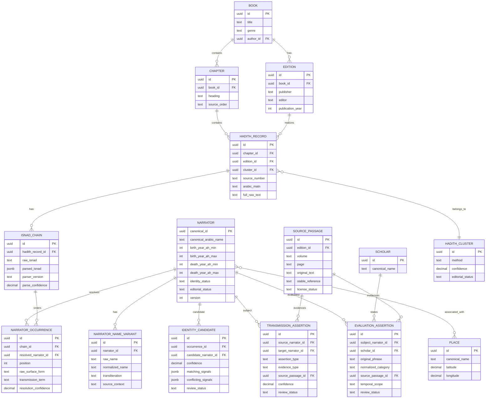

# Relationales Datenmodell

## Modellierungsentscheidungen

- Die Kettenposition (`NARRATOR_OCCURRENCE`) ist nicht die historische Person (`NARRATOR`). Dadurch bleibt eine ungeklärte Namensform importierbar, ohne sie vorschnell zu verschmelzen.
- `TRANSMISSION_ASSERTION` modelliert fachliche Behauptungen; konkrete Vorkommen in einer Kette werden zusätzlich aus benachbarten `NARRATOR_OCCURRENCE`-Datensätzen abgeleitet.
- Jeder Import bleibt editions- und nummerierungsspezifisch. Cluster ersetzen keine Originaldatensätze.
- Fachliche Tabellen sind append-only versionierbar. Korrekturen erzeugen neue Revisionen; Audit-Ereignisse speichern Vorher/Nachher und Begründung.
