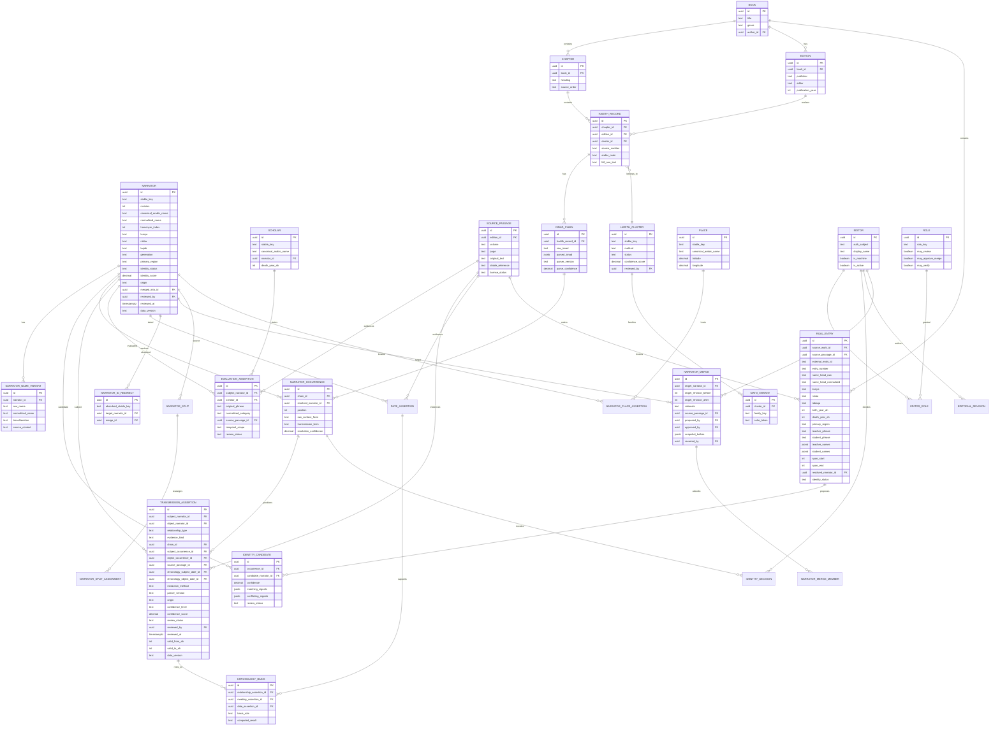

# Relationales Datenmodell

Maßgeblich ist `database/schema.sql`. Dieses Dokument erklärt die Entscheidungen;
bei Abweichung gilt das Schema.

Im Schema heißt `TRANSMISSION_ASSERTION` `relationship_assertion` und
`EVALUATION_ASSERTION` heißt `grade_assertion`; `BOOK` ist `source_work`.

## Modellierungsentscheidungen

- Die Kettenposition (`NARRATOR_OCCURRENCE`) ist nicht die historische Person (`NARRATOR`). Dadurch bleibt eine ungeklärte Namensform importierbar, ohne sie vorschnell zu verschmelzen.
- `TRANSMISSION_ASSERTION` modelliert fachliche Behauptungen; konkrete Vorkommen in einer Kette werden zusätzlich aus benachbarten `NARRATOR_OCCURRENCE`-Datensätzen abgeleitet.
- Jeder Import bleibt editions- und nummerierungsspezifisch. Cluster ersetzen keine Originaldatensätze.
- Fachliche Tabellen sind append-only versionierbar. Korrekturen erzeugen neue Revisionen; Audit-Ereignisse speichern Vorher/Nachher und Begründung.
- `RIJAL_ENTRY` ist eine Quellenstelle, keine Person. Ein Treffer in Tahdhīb bleibt ein Identitätskandidat und wird nicht mit anderen Treffern verschmolzen. Deshalb kann `IDENTITY_CANDIDATE` auf `NARRATOR` **oder** auf `RIJAL_ENTRY` zeigen, niemals auf beides.
- `SCHOLAR` ist von `NARRATOR` getrennt, weil ein Kritiker in dieser Rolle auftritt und nicht als Kettenglied. Ist der Kritiker zugleich ein bekannter Überlieferer, verbindet `scholar.narrator_id` beide, ohne die Rollen zu vermischen.
- Namensformen sind gegen stille Reimport-Dubletten geschützt, ohne Homonyme zu verbieten: der partielle UNIQUE-Index `narrator_normalized_name_key` gilt auf `(normalized_name, homonym_index)` und nur für nicht absorbierte Zeilen. Zwei gleichnamige Personen brauchen also einen ausdrücklichen `homonym_index` — eine Entscheidung, nicht ein Zufall des Importlaufs.

## Kanonische Identität, Merge und Split

Nach außen ist eine Person `stable_key` plus `revision`, nicht die interne uuid.

| Vorgang | Wirkung |
|---|---|
| Anlegen | `stable_key = SA-P-<base32(8)>`, `revision = 1` |
| Merge | `revision` der Zielperson steigt; absorbierte Zeilen bleiben stehen, erhalten `merged_into_id` und je einen Eintrag in `narrator_id_redirect` |
| Split | `revision` der Quellperson steigt; `narrator_split_assignment` nennt für jede betroffene Position das ausdrücklich gewählte Ziel oder stellt sie auf `unresolved` zurück |
| Ruecknahme | `narrator_merge.snapshot_before` wird zurückgespielt; die kanonische ID der wiederhergestellten Person ist unverändert |

Merge und Split verlangen `proposed_by <> approved_by`, eine Begründung von
mindestens zwölf Zeichen und eine Quellenpassage. Die Historie ist append-only:
`editorial_revision`, `identity_decision`, `narrator_split`,
`narrator_merge_member` und `narrator_split_assignment` lassen kein UPDATE und
kein DELETE zu. `narrator_merge` erlaubt als einzige Ausnahme das Setzen der drei
Rücknahmefelder, alles andere bleibt unveränderlich.

## Antwort-Hülle: welche Spalte trägt welches API-Feld

Jede fachliche API-Antwort führt dieselben sieben Felder. Keines wird zur Laufzeit
erfunden; jedes hat eine Spalte.

| API-Feld | Spalte | Anmerkung |
|---|---|---|
| `sourceReferences` | `source_passage_id` (NOT NULL) plus `evidence_link` | die Pflichtquelle ist ein Fremdschlüssel, weitere Quellen liegen in `evidence_link` |
| `confidenceLevel` | `confidence_level`, auf Personen und Positionen `identity_status` | ENUM mit sechs Stufen |
| `confidenceScore` | `confidence_score` | 0..1 oder null; nur maschinell, siehe `*_score_is_machine` |
| `origin` | `origin` | `machine \| editorial \| registry` |
| `reviewStatus` | `review_status` | fünf Werte |
| `dataVersion` | `data_version` | `NOT NULL` ohne Default |
| `lastReviewedAt` | `reviewed_at` | war strukturell immer null, weil die Spalte nur auf `hadith_cluster` existierte |

Für die beiden häufigsten Fälle liefern die Sichten `narrator_envelope` und
`rijal_entry_envelope` diese Felder bereits unter den Vertragsnamen.

## Quellenpflicht als Mechanismus

`NOT NULL` auf `source_passage_id` gilt für: `hadith_record`,
`hadith_number_alias`, `narrator_name_variant`, `rijal_entry`, `date_assertion`,
`relationship_assertion`, `grade_assertion`, `narrator_place_assertion`,
`place_name_variant`, `identity_decision`, `narrator_merge`, `narrator_split`,
`editorial_revision`, `evidence_link`.

Ausnahme mit Begründung: `meeting_assertion.source_passage_id` bleibt nullable,
weil `contemporary_only` und `impossible` keine Textstelle behaupten, sondern aus
Datierungen berechnet werden. Genau dafür verlangt
`meeting_chronology_needs_dates` beide `chronology_*_date_id`, und
`meeting_claim_needs_evidence` lässt `met` und `heard_from` nur mit Passage oder
Kettenbezug zu. Eine berechnete Gleichzeitigkeit kann sich damit nicht in ein
Hören verwandeln.

## Was bewusst nicht im Schema steht

- Kein aggregierter Zuverlässigkeitswert je Person. Kritikeraussagen bleiben einzeln in `grade_assertion` mit Werk, Band und Seite.
- Kein Mittelwert über widersprüchliche Datierungen. Jede Angabe ist eine eigene `date_assertion`-Zeile; Widersprüche bleiben sichtbar.
- Kein geschätztes Geburtsjahr. `date_assertion_birth_never_derived` verbietet `is_derived = true` für `event_type = 'birth'`.
- Keine exklusiven Daten in Projektionen. `relationship_projection` und `transmission_evidence` sind Sichten und jederzeit neu aufbaubar.
