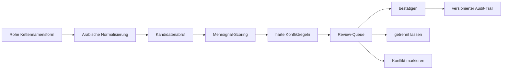

# Entity-Resolution-Konzept

## Pipeline

## 1. Normalisierung

- Diakritika und Tatwīl entfernen, Alif-/Hamza-/Yāʾ-Varianten indexseitig vereinheitlichen.
- Rohform unverändert erhalten; Normalisierung ist eine zusätzliche Suchrepräsentation.
- Ibn/bin, Kunya-Flexion und Transliteration nur als Kandidatensignale behandeln.
- Relative Ausdrücke wie „sein Vater“ oder „sein Onkel“ im Kettenkontext auflösen, nicht als Name normalisieren.

## 2. Kandidatenabruf

- Exakte und fuzzy Namensvarianten.
- Kunya, Nisba, Nasab-Komponenten und bekannte Abkürzungen.
- Nachbarschaftskandidaten aus vorherigem/nächstem Überlieferer.
- Ṭabaqa-, Zeit- und Regionsfenster.

## 3. Scoring

| Signal | Richtung | Beispielgewicht |
|---|---|---:|
| kanonische Namensähnlichkeit | positiv | 0.22 |
| bekannte Namensvariante | positiv | 0.18 |
| Lehrer-/Schülernachbarschaft | positiv | 0.22 |
| Chronologie plausibel | positiv | 0.14 |
| Region/Reise plausibel | positiv | 0.08 |
| Buch-/Autor-Muster | positiv | 0.06 |
| widersprüchliches Todesjahr | negativ | -0.25 |
| unmögliche Chronologie | harter Block | reject auto-merge |
| expliziter Quellenkonflikt | harter Block | conflict |

Gewichte werden kalibriert und versioniert; sie sind keine fachlichen Wahrheiten.

## 4. Entscheidungsstufen

Genau diese sechs Stufen gelten im ganzen Projekt. Es gibt kein zweites Vokabular.

| Stufe | Bedingung | Wer darf sie setzen |
|---|---|---|
| `verified` | durch qualifizierten Editor bestätigt und belegt | ausschließlich redaktionell |
| `high` | Score ≥ 0,90, keine harten Konflikte; bleibt dennoch Vorschlag | maschinell |
| `medium` | Score 0,70–0,89 | maschinell |
| `low` | Score < 0,70 | maschinell |
| `unresolved` | kein tragfähiger Kandidat | maschinell |
| `conflict` | harte Gegenbelege oder konkurrierende starke Kandidaten | maschinell und redaktionell |

Die Stufen sind an genau drei Stellen identisch definiert und dürfen nur gemeinsam
geändert werden:

| Ort | Form |
|---|---|
| `database/schema.sql` | `CREATE TYPE confidence_level AS ENUM ('verified','high','medium','low','unresolved','conflict')` |
| `lib/types.ts` | `export type ConfidenceLevel` plus `CONFIDENCE_LEVELS` und `CONFIDENCE_THRESHOLDS` |
| dieses Dokument | die Tabelle oben |

Der Vorgängerstand kannte drei unvereinbare Vokabulare: `lib/types.ts` ohne
`unresolved`, `schema.sql` mit `candidate` statt der drei Stufen, und diese Datei
mit sechs nirgends implementierten Stufen. `database/migrations/0001_status_vocabulary.sql`
bildet `candidate` anhand des vorhandenen Scores auf `high`, `medium` oder `low` ab;
wo kein Score existiert, lautet das Ergebnis `unresolved` und nicht `low` — eine
fehlende Messung ist keine schwache Messung.

### Automatische Verarbeitung setzt niemals `verified`

Das ist keine Konvention, sondern eine Zusicherung der Datenbank. `verified`
verlangt kumulativ:

1. `origin = 'editorial'` — maschinelle Zeilen tragen `origin = 'machine'` und
   erfüllen die Bedingung nie;
2. `reviewed_by IS NOT NULL` — ein benanntes Editorkonto;
3. `reviewed_at IS NOT NULL` — ein Zeitpunkt, aus dem `lastReviewedAt` entsteht;
4. ein Konto mit `editor.is_machine = true` darf `reviewed_by` nicht besetzen.

Punkte 1 bis 3 stehen als CHECK auf jeder betroffenen Tabelle
(`<tabelle>_verified_is_editorial`, `<tabelle>_review_pair`), Punkt 4 als Trigger
`sanad_reviewer_must_be_human`. Eine Pipeline, die `verified` schreiben will,
scheitert an der Einfügung — sie kann die Regel nicht umgehen, indem sie
`origin = 'editorial'` behauptet.

Ebenso mechanisch abgesichert:

- **Stufe und Score dürfen sich nicht widersprechen.** `<tabelle>_level_threshold`
  prüft `high ≥ 0,90`, `medium 0,70–0,89`, `low < 0,70`. `verified`, `unresolved`
  und `conflict` sind ausgenommen, weil sie keine Schwellenaussage sind.
- **`confidenceScore` ist ein maschinelles Artefakt.**
  `<tabelle>_score_is_machine` verbietet einen Score, wenn
  `extraction_method = 'manual'`. Eine redaktionelle Entscheidung trägt eine
  Begründung, keine Zahl.
- **Ein Kandidat wird nie zur Person.** `identity_candidate` verweist entweder auf
  `narrator` oder auf `rijal_entry`, niemals auf beides, und trägt
  `requiresEditorialDecision` implizit dadurch, dass nur `identity_decision` eine
  Position verbindlich zuordnet.
- **Eine relative Namensform bleibt an ihre Position gebunden.**
  `narrator_occurrence.is_relative_form` plus
  `narrator_occurrence_relative_needs_editor` verhindern, dass أبيه ohne
  redaktionelle Entscheidung eine aufgelöste Person erhält.

## 5. Merge/Split

- Merge erzeugt eine neue kanonische Revision und Aliaszuordnungen; Quelldatensätze bleiben unverändert.
- Split spielt betroffene Occurrences auf explizit ausgewählte Zielidentitäten zurück.
- Beide Aktionen verlangen Begründung, Quelle, Vier-Augen-Freigabe und speichern ein reversibles Event.

Mechanisch:

| Anforderung | Umsetzung |
|---|---|
| kanonische ID bleibt stabil | `narrator.stable_key` im Format `SA-P-<base32(8)>`, CHECK `narrator_stable_key_format` |
| Merge erzeugt neue Revision | `narrator.revision`; `narrator_merge.target_revision_after > target_revision_before` |
| absorbierte ID bleibt auflösbar | `narrator_id_redirect`; die absorbierte Zeile wird nicht gelöscht, sondern über `narrator.merged_into_id` markiert |
| Vier-Augen-Freigabe | `narrator_merge_four_eyes` und `narrator_split_four_eyes`: `proposed_by <> approved_by` |
| Begründung | `rationale text NOT NULL CHECK (length(trim(rationale)) >= 12)` |
| Quelle | `source_passage_id uuid NOT NULL` |
| reversibel | `snapshot_before jsonb NOT NULL`; `narrator_merge.reverted_by/reverted_at`; `narrator_split.reverses_merge_id` |
| Historie unveränderlich | Trigger `sanad_merge_guard`, `narrator_split_append_only`, `editorial_revision_append_only` |

Die Auflösung einer absorbierten ID folgt der Redirect-Kette, bis kein Redirect
mehr existiert, mit einer harten Grenze von acht Schritten. Ein Split, der einen
Merge zurücknimmt, setzt `reverses_merge_id` und stellt die Occurrences aus
`snapshot_before` wieder her; die kanonische ID der wiederhergestellten Person ist
dieselbe wie vor dem Merge.

## 6. Evaluierung

- Goldstandard aus doppelt annotierter Stichprobe; Uneinigkeit wird fachlich adjudiziert.
- Metriken getrennt nach Namenslänge, Kunya, Nisba, relativer Form und häufigen Homonymen.
- Optimierungsziel: hohe Präzision bei Auto-Vorschlägen; Recall darf zugunsten sichtbarer Ungewissheit geringer sein.
