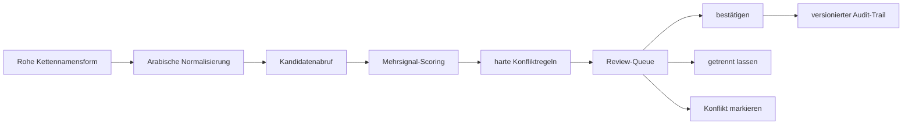

# Entity-Resolution-Konzept

## Pipeline

## 1. Normalisierung

- Diakritika und Tatwīl entfernen, Alif-/Hamza-/Yāʾ-Varianten indexseitig vereinheitlichen.
- Rohform unverändert erhalten; Normalisierung ist eine zusätzliche Suchrepräsentation.
- Ibn/bin, Kunya-Flexion und Transliteration nur als Kandidatensignale behandeln.
- Relative Ausdrücke wie „sein Vater“ oder „sein Onkel“ im Kettenkontext auflösen, nicht als Name normalisieren.

## 2. Kandidatenabruf

- Exakte und fuzzy Namensvarianten.
- Kunya, Nisba, Nasab-Komponenten und bekannte Abkürzungen.
- Nachbarschaftskandidaten aus vorherigem/nächstem Überlieferer.
- Ṭabaqa-, Zeit- und Regionsfenster.

## 3. Scoring

| Signal | Richtung | Beispielgewicht |
|---|---|---:|
| kanonische Namensähnlichkeit | positiv | 0.22 |
| bekannte Namensvariante | positiv | 0.18 |
| Lehrer-/Schülernachbarschaft | positiv | 0.22 |
| Chronologie plausibel | positiv | 0.14 |
| Region/Reise plausibel | positiv | 0.08 |
| Buch-/Autor-Muster | positiv | 0.06 |
| widersprüchliches Todesjahr | negativ | -0.25 |
| unmögliche Chronologie | harter Block | reject auto-merge |
| expliziter Quellenkonflikt | harter Block | conflict |

Gewichte werden kalibriert und versioniert; sie sind keine fachlichen Wahrheiten.

## 4. Entscheidungsstufen

- `verified`: durch qualifizierten Editor bestätigt und belegt.
- `high`: ≥ 0,90, keine harten Konflikte; bleibt dennoch Vorschlag.
- `medium`: 0,70–0,89.
- `low`: < 0,70.
- `unresolved`: kein tragfähiger Kandidat.
- `conflict`: harte Gegenbelege oder konkurrierende starke Kandidaten.

Automatische Verarbeitung setzt niemals `verified`.

## 5. Merge/Split

- Merge erzeugt eine neue kanonische Revision und Aliaszuordnungen; Quelldatensätze bleiben unverändert.
- Split spielt betroffene Occurrences auf explizit ausgewählte Zielidentitäten zurück.
- Beide Aktionen verlangen Begründung, Quelle, Vier-Augen-Freigabe und speichern ein reversibles Event.

## 6. Evaluierung

- Goldstandard aus doppelt annotierter Stichprobe; Uneinigkeit wird fachlich adjudiziert.
- Metriken getrennt nach Namenslänge, Kunya, Nisba, relativer Form und häufigen Homonymen.
- Optimierungsziel: hohe Präzision bei Auto-Vorschlägen; Recall darf zugunsten sichtbarer Ungewissheit geringer sein.
